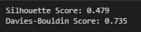
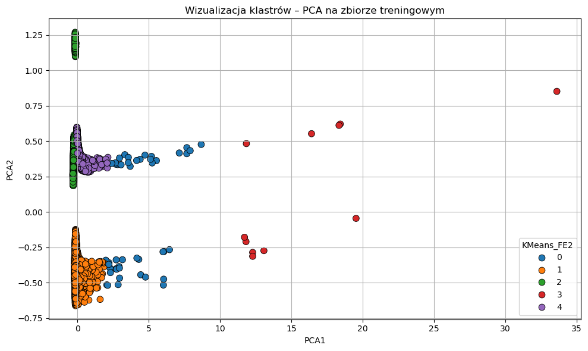
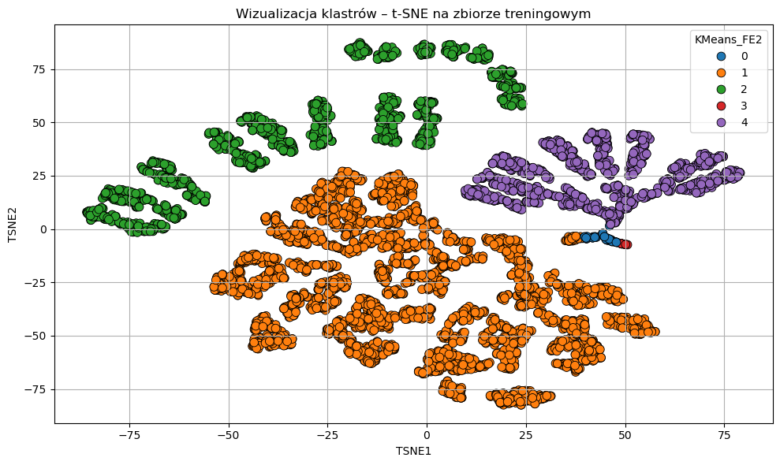
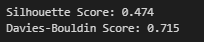
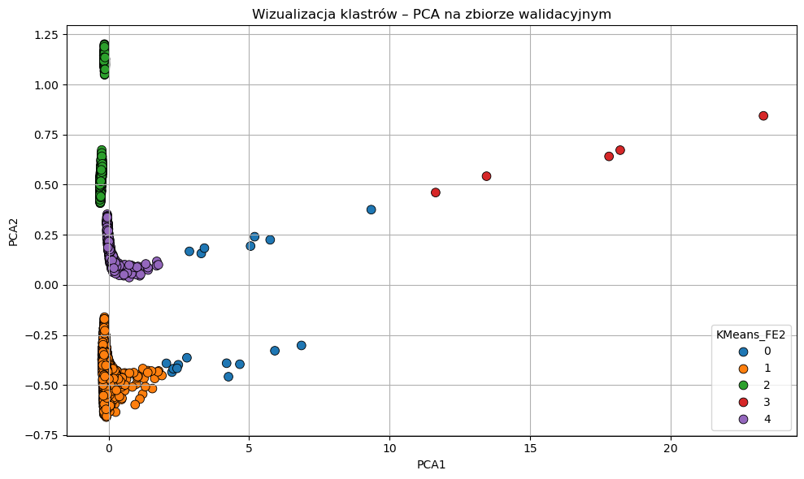
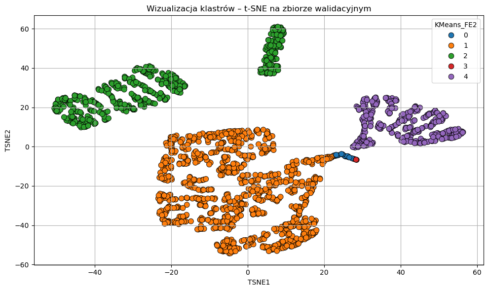

## 1 & 2 kamienie milowe

Brak jasno określonego celu biznesowego
Eda została poprawnie i bardzo dokładnie przeprowadzaona. 
Kolumny binarne stanowią większość kolumny w ramce danych. Warto rozważyć modyfikacje metryk np. coś na podobieństwo metryki Hamminga albo przeprowadzić od nowa feature engineering
Duża różnorodność w algorytmach klasteryzujących.

## 3 kamień milowy

Warto zastanowić się nad bardziej obiektywnym podejściem do nadawania wag zmiennym transakcyjnym – zamiast arbitralnie rozkładać je liniowo od 0,14 do 1,0, można by wykorzystać ich zmienność czy miarę istotności albo przynajmniej przeprowadzić analizę wrażliwości, by sprawdzić, jak różne zestawy wag wpływają na strukturę klastrów. Podobnie jeśli chodzi o wizualizację za pomocą t-SNE – domyślne parametry (perplexity = 30, init = PCA) nie zawsze są optymalne, dlatego warto eksperymentować z różnymi wartościami perplexity i learning_rate. 

Dodatkowo warto rozszerzyć paletę testowanych algorytmów – poza KMeans można byłoby porównać wyniki z DBSCAN, klastrowaniem hierarchicznym czy modelami mieszankowymi Gaussa, co pozwoliłoby wyłonić najbardziej naturalne podziały w zbiorze **\***.

Brak podziału danych na dane treningowe, testowe oraz walidacyjne **\***.

Wyniki końcowe bardzo dobre z ciekawymi uzasadnieniem decyzji modelu wraz z interpretacjami.

**\*** *błędy zostały naprawione po walidacji projektu, ale przed wygenerowaniem poniższej oceny ilościowej*

---

Finalny model oceniono również za pomocą metryk ilościowych oraz jakościowych na specjalnie wydzielonym zbiorze walidacyjnym. W porównaniu do wyników na danych treningowych:







Na zbiorze walidacyjnym wyniki odpowiednie wyniki prezentują się następująco:







Wyniki liczbowe silhouette score oraz Davies-Boluding score są nieznacznie niższe na danych walidacyjnych co oznacza, że model nie jest przeuczony, ale jednocześnie jest stabilny dla niewidzianych wcześniej danych. Również wizualizacje klastrów przy pomocy PCA oraz t-SNE wyglądają bardzo analogicznie do tych ze zbioru treningowego, co potwierdza tezę o skuteczności modelu dla niewidzianych wcześniej danych.


Kod użyty do otrzymania powyższych wizualizacji (dotyczących danych walidacyjnych, uruchomiony wewnątrz folderu projektowego walidowanej grupy):

```python
from sklearn.cluster import KMeans
import matplotlib.pyplot as plt
import pandas as pd
from sklearn.metrics import silhouette_score, davies_bouldin_score
from sklearn.decomposition import PCA
import seaborn as sns
from sklearn.manifold import TSNE

val = pd.read_csv('data/val_data.csv')
train = pd.read_csv('data/train_data.csv')

k = 5 
kmeans = KMeans(n_clusters=k, random_state=42, n_init=10)
train['KMeans_FE2'] = kmeans.fit_predict(train)
val_res = kmeans.predict(val)

sil_score = silhouette_score(val, val_res)
db_score = davies_bouldin_score(val, val_res)

print(f"Silhouette Score: {sil_score:.3f}")
print(f"Davies-Bouldin Score: {db_score:.3f} ")

pca = PCA(n_components=2, random_state=42)
X_pca = pca.fit_transform(val)

val['PCA1'] = X_pca[:, 0]
val['PCA2'] = X_pca[:, 1]

plt.figure(figsize=(10, 6))
sns.scatterplot(x=val['PCA1'], y=val['PCA2'], hue=val_res, palette='tab10', s=60, edgecolor='black')
plt.title('Wizualizacja klastrów – PCA na zbiorze walidacyjnym')
plt.grid(True)
plt.tight_layout()
plt.show()

tsne = TSNE(n_components=2, perplexity=30, learning_rate='auto', init='pca', random_state=42)
X_tsne = tsne.fit_transform(val)
val['TSNE1'] = X_tsne[:, 0]
val['TSNE2'] = X_tsne[:, 1]
plt.figure(figsize=(10, 6))
sns.scatterplot(
    x=val['TSNE1'],
    y=val['TSNE2'],
    hue=val_res,
    palette='tab10',
    s=60,
    edgecolor='black'
)
plt.title('Wizualizacja klastrów – t-SNE na zbiorze walidacyjnym')
plt.grid(True)
plt.tight_layout()
plt.show()


```


